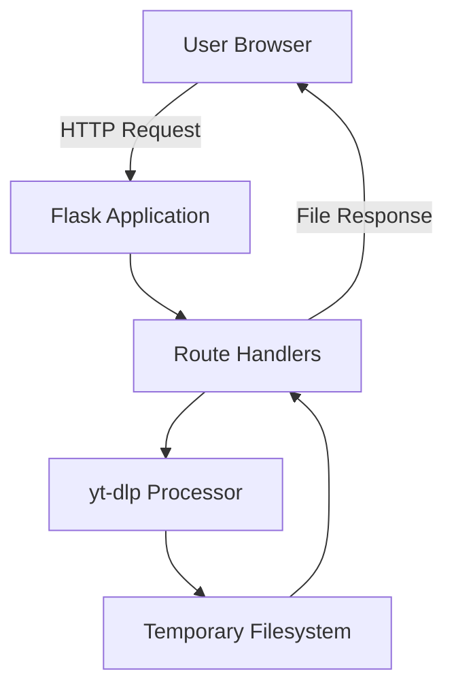

# YT Downloader – Local Media Processing Pipeline

A lightweight, container-ready media processing service built with **Flask** and **yt-dlp**.
This project provides a clean and secure solution for downloading YouTube videos or extracting audio while demonstrating best practices in documentation, architecture, and cloud‑readiness—ideal for DevOps and Cloud Engineering portfolios.

---

## 🚀 Key Features

- **Fast YouTube video downloads** using `yt-dlp`
- **Automatic MP3 audio extraction**
- **Clean web UI** built with Jinja2 templates
- **Stateless design** (no file persistence; temporary files only)
- **Production-ready Dockerfile**
- **Optional Azure deployment instructions**

---

## 🏗 Architecture



---

## 📁 Project Structure

```
yt-downloader/
│
├── app.py                # Flask application and routing logic
├── requirements.txt      # Python dependencies
├── Dockerfile            # Production-ready container image definition
├── templates/            # HTML templates (UI)
└── static/               # CSS and assets
```

---

## ⚙️ Local Setup (Development)

### 1. Clone the repository
```bash
git clone https://github.com/oliverjueguen/yt-downloader.git
cd yt-downloader
```

### 2. Create a virtual environment
```bash
python -m venv venv
source venv/bin/activate   # macOS / Linux
venv\Scriptsctivate      # Windows
```

### 3. Install dependencies
```bash
pip install -r requirements.txt
```

### 4. Run the application
```bash
python app.py
```

### 5. Open the UI
```
http://localhost:5000
```

---

## 🐳 Running with Docker (Recommended)

### Build the image
```bash
docker build -t yt-downloader .
```

### Run the container
```bash
docker run -d -p 5000:5000 yt-downloader
```

Service available at:
```
http://localhost:5000
```

---

## ☁️ Optional: Deploying to Azure

> These deployment steps are optional and demonstrate cloud‑readiness for recruiters.

### Option A — Azure App Service (Docker)

1. Build and push the image to ACR:
```bash
az acr build --image yt-downloader:v1 --registry <acrName> --file Dockerfile .
```

2. Create the Web App:
```bash
az webapp create   --name yt-downloader-app   --resource-group <group>   --plan <appServicePlan>   --deployment-container-image-name <acrName>.azurecr.io/yt-downloader:v1
```

### Option B — Azure Container Apps
```bash
az containerapp create   --name yt-downloader   --resource-group <group>   --environment <containerEnv>   --image <acrName>.azurecr.io/yt-downloader:v1   --target-port 5000   --ingress external
```

---

## 🔧 Tech Stack

- **Python 3.10+**
- **Flask**
- **yt-dlp**
- **Docker**
- **Azure (optional)**

---

## 📈 Roadmap

| Feature | Status | Priority |
|--------|--------|----------|
| Add download progress indicator | Planned | Medium |
| Playlist download support | Planned | High |
| API mode (JSON endpoints) | Planned | High |
| Authentication layer (API key) | Planned | Medium |
| Logging & Azure Application Insights | Planned | Medium |

---

## 📄 License

MIT License.
